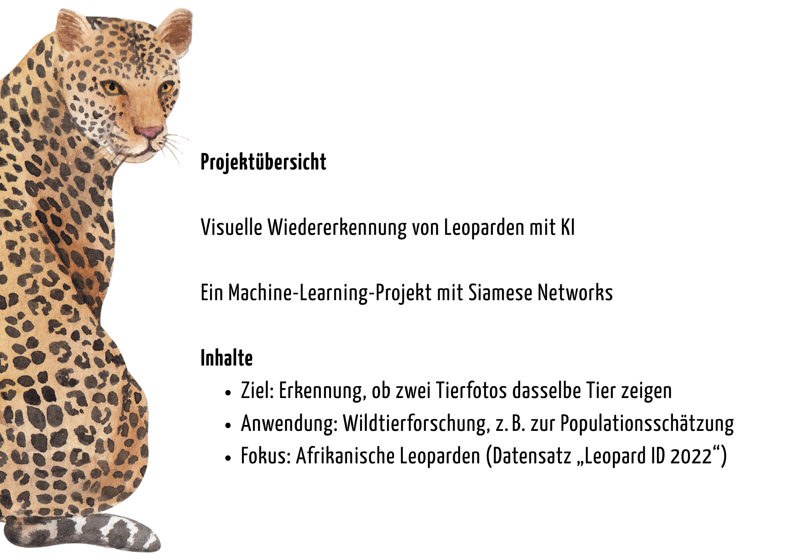
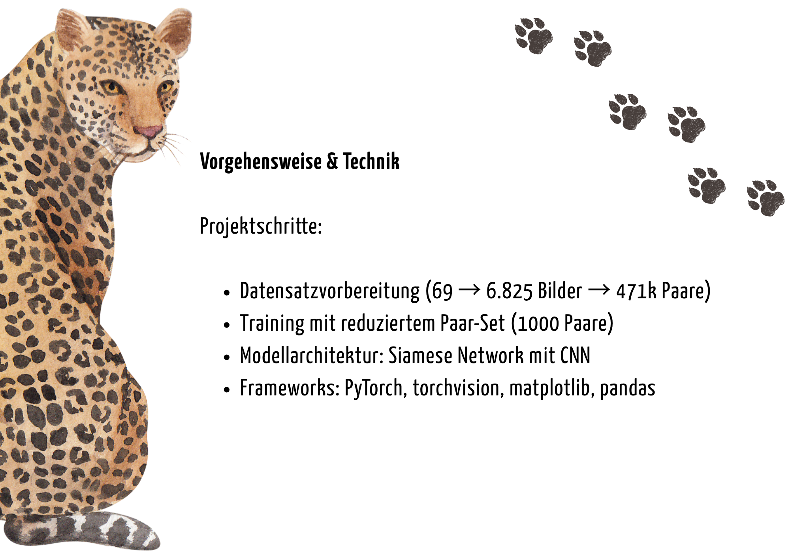
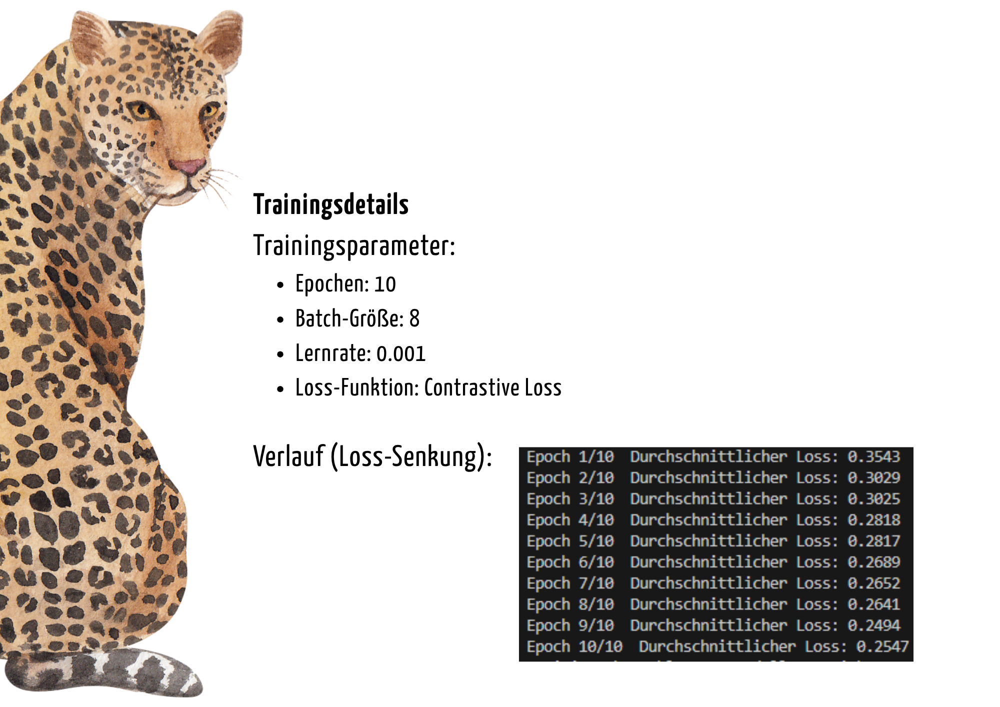
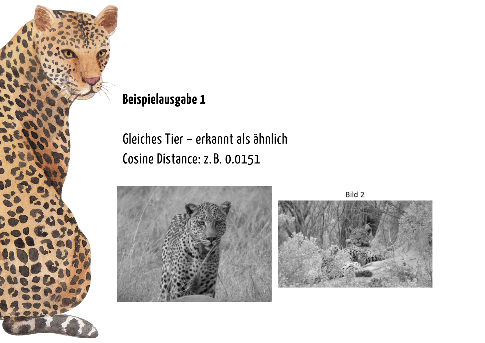
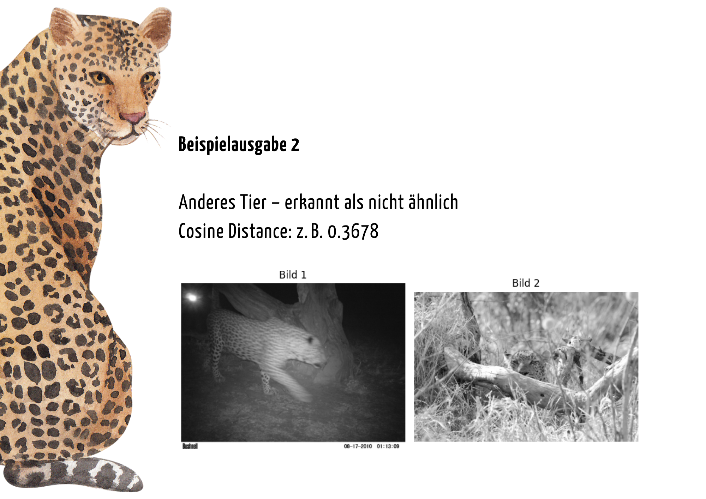

# 🐅 wildlife-reid-tiger – ML-Projekt zur visuellen Wiedererkennung von Wildtieren

## Ziel des Projekts

Dieses Projekt entwickelt ein Machine-Learning-Modell zur visuellen Wiedererkennung einzelner Tiere – mit Fokus auf Tiger. Ziel ist es, anhand von Kamerafallen-Bildern zu erkennen, ob dasselbe Tier mehrfach erscheint – trotz unterschiedlicher Perspektiven, Lichtverhältnisse oder Körperhaltungen.

Solche Re-Identification-Modelle werden bereits in der Wildtierforschung eingesetzt, um z. B. Populationsgrößen besser zu erfassen oder Bewegungsmuster zu analysieren.

## Motivation

- **Ökologisch relevant**: Unterstützt Forschung zum Artenschutz
- **Technisch spannend**: Anwendung von Deep Learning mit Siamese-Architektur
- **Portfolio-wirksam**: Kombination aus Computer Vision, Re-ID und Datenverständnis

## Geplante Schritte

1. **Projektplanung**
   - Zielsetzung und Recherche zu Re-ID im Kontext Wildtiere
      Ziel dieses Projekts ist es, ein Machine-Learning-Modell zu entwickeln, das individuelle afrikanische Leoparden anhand von Kamerafallen-Bildern wiedererkennt.  
      Die Herausforderung besteht darin, trotz unterschiedlicher Blickwinkel, Lichtverhältnisse und Posen das gleiche Tier zuverlässig zu identifizieren.  
      Der Datensatz „Leopard ID 2022“ liefert dafür echte Tier-IDs, Bounding Boxes und zusätzliche Informationen wie Blickrichtung und Zeitstempel.  
      Das Projekt soll die visuelle Wiedererkennung (Re-Identification) durch ein Siamese- oder Triplet-Netzwerk ermöglichen und die Qualität der Zuordnung mithilfe von geeigneten Metriken evaluieren.
   - Auswahl geeigneter öffentlich zugänglicher Datensätze:
     - **Verglichen**: Desert Lion, WCS Camera Traps, Leopard ID 2022
     - **Entschieden**: Leopard ID 2022, da echte Tier-IDs, Bounding Boxes, Blickrichtung, Zeitinfos enthalten sind → optimal für Re-Identification
      Datensatz: Botswana Predator Conservation Trust (2022). Panthera pardus CSV-Export. Abgerufen aus African Carnivore Wildbook vom 28.04.2022.
     - Erste Analyse der Metadaten ergab, dass nur 69 Bilder eine eindeutige Zuordnung zu genau einer Individuen-ID enthalten.  
      Um die Komplexität niedrig zu halten und einen realistischen Startpunkt zu schaffen, wird das initiale Modell auf genau diesen 69 Bildern aufgebaut.  
      Die restlichen Annotationen mit Mehrfachzuordnungen bleiben vorerst ungenutzt, könnten aber in einem zweiten Schritt eingebunden werden.

      Die ursprünglich gewählten 69 Datensätze enthielten jeweils nur eine eindeutige Individuen-ID, aber kein Tier kam mehrfach vor – daher war keine Paarbildung möglich.
      Um ein echtes Trainingsset zu erzeugen, habe ich das Filterkriterium erweitert:
      Alle Annotationen mit mindestens einer individual_id wurden zugelassen, und wenn mehrere IDs enthalten waren, habe ich einfach die erste ID verwendet.
      So konnte ich 6.825 Bilder nutzen und daraus über 471.000 positive sowie 471.000 negative Bildpaare generieren – eine gute Grundlage für das Training eines Re-ID-Modells.

   - Definition der Erfolgskriterien:
      Ich verwende Top-1 Accuracy als Hauptmetrik: Das Modell soll das richtige Tierbild an erster Stelle erkennen.
      Während des Trainings verwende ich außerdem die Cosine Similarity, um zu prüfen, wie ähnlich zwei Bilder sind.
      Optional könnte ich später noch Top-5 Accuracy oder mean Average Precision (mAP) nutzen, wenn das Modell stabil läuft.


2. **Datenvorbereitung**
   - Strukturieren und ggf. Zuschneiden der Bilder
   - Kategorisierung nach Tier-ID
   - Sicherstellung einheitlicher Größen, Formate und Helligkeit

3. **Modellaufbau**
   - Kleines Siamese-Netzwerk in PyTorch erstellt
   - Arbeitet mit Graustufenbildern (1 Kanal, 100×100 Pixel)
   - Besteht aus gemeinsamem CNN + FC-Layer → 32-dimensionale Embeddings
   - Funktioniert mit `PairDataset` und gibt zwei Embeddings zurück
   - Erste Tests mit Zufallsbildern erfolgreich durchgeführt
   - Modell ist einsatzbereit für Training mit echten Paaren


4. **Training und Evaluation**
     - Durchführung des Trainings mit einem Teilset (1000 Paaren) zur Dokumentation im Portfolio.
     - Lernrate: 0.001, Batch Size: 8, Epochs: 10
     - Verlustfunktion: Contrastive Loss
     - Ergebnis (Durchschnittlicher Loss):
       
       | Epoch | Loss |
       |-------|------|
       | 1     | 0.3543 |
       | 2     | 0.3029 |
       | 3     | 0.3025 |
       | 4     | 0.2818 |
       | 5     | 0.2817 |
       | 6     | 0.2689 |
       | 7     | 0.2652 |
       | 8     | 0.2641 |
       | 9     | 0.2494 |
       | 10    | 0.2547 |

     - Das Modell wurde gespeichert unter: `models/siamese_20250617-1348.pt`
     - Aufgrund begrenzter Rechenleistung wurde bewusst nur ein Teilset verwendet. Ziel war ein demonstrierbares Ergebnis mit dokumentiertem Trainingsverlauf.

     - Beispielpaare siehe Präsentation.

     Die Cosine Distance wurde als Maß für visuelle Ähnlichkeit berechnet.

5. **Dokumentation & Reflexion**

   - Das Modell zeigt bei kleinem Trainingsumfang bereits ein erkennbares Lernverhalten. Die Cosine-Distanzen unterscheiden zuverlässig ähnliche und unähnliche Bildpaare.
   - Der Verlust (Contrastive Loss) sank im Verlauf der 10 Epochen kontinuierlich, was auf eine gute Konvergenz hindeutet.
   - Einschränkungen: Training wurde bewusst auf 1000 Paare begrenzt, um Speicher- und Rechenzeit zu schonen. Dies erlaubt keine Aussagen über Generalisierbarkeit.
   - Für den Demonstrationszweck im Portfolio ist das Projekt erfolgreich abgeschlossen.
   - **Vorschläge zur Weiterentwicklung:**
     - Training auf dem vollständigen Datensatz (471k Paarungen) zur Bewertung echter Top-1-Genauigkeit
     - Einbindung weiterer Tierarten zur Erprobung der Generalisierbarkeit
     - Aufbau einer Web-Demo mit Upload-Funktion (z. B. mit Streamlit), um Ähnlichkeitsvergleiche live zu testen

## Technologien & Tools

- Python 3.10+
- PyTorch – für Modellarchitektur und Training
- torchvision – für Datenvorverarbeitung und Transformationspipelines
- Matplotlib – zur Visualisierung von Bildpaaren und Ähnlichkeitswerten
- Pandas – zur Handhabung des Pair-Datensatzes
- Visual Studio Code – als Entwicklungsumgebung

## Projektstruktur (geplant)

```
wildlife-reid-tiger/
├── data/            # Rohdaten und bearbeitete Bilder (nicht im Repo)
├── models/          # Trainierte Modelle (ignored)
├── src/             # Trainingslogik, Netzarchitekturen, Hilfsfunktionen
├── outputs/         # Visualisierungen für Präsentation (optional)
├── README.md        # Projektdokumentation
├── requirements.txt # Python-Abhängigkeiten
└── .gitignore       # Ausschlussregeln für sensible/große Dateien
```

## Projekt-Präsentation

Hier ist eine visuelle Zusammenfassung des Projekts als Präsentation:

| Slide | Inhalt                     |
|-------|----------------------------|
| 1     | Projektübersicht           |
| 2     | Methodik & Technik         |
| 3     | Trainingsparameter         |
| 4     | Beispielausgabe: Gleiches Tier |
| 5     | Beispielausgabe: Verschiedenes Tier |

<p align="center">
  <br>
  <br>
  <br>
  <br>
  
</p>

## Dataset License & Citation

This project uses the **Leopard ID 2022** dataset made available by the Botswana Predator Conservation Trust and Kasim Rafiq, in collaboration with Wild Me.

- License: **Community Data License Agreement (CDLA) – Permissive variant**
- Source: African Carnivore Wildbook, 2022-04-28
- Contact: info@wildme.org
- Dataset format: MS COCO-style JSON annotations with bounding boxes and unique leopard IDs

If you use this dataset in published work, please cite as:

> Botswana Predator Conservation Trust (2022). *Panthera pardus CSV custom export*. Retrieved from African Carnivore Wildbook 2022-04-28.

## License

This project is provided under the following terms:

- All **non-code content** (texts, project idea, images, visualizations) is licensed under **CC BY-NC 4.0**  
  → https://creativecommons.org/licenses/by-nc/4.0/

- The **source code** is free to use and adapt for **non-commercial purposes**, with attribution.  
  Commercial use requires permission: ngassert@web.de

© 2025 Nathalie Gassert

[](https://creativecommons.org/licenses/by-nc/4.0/)